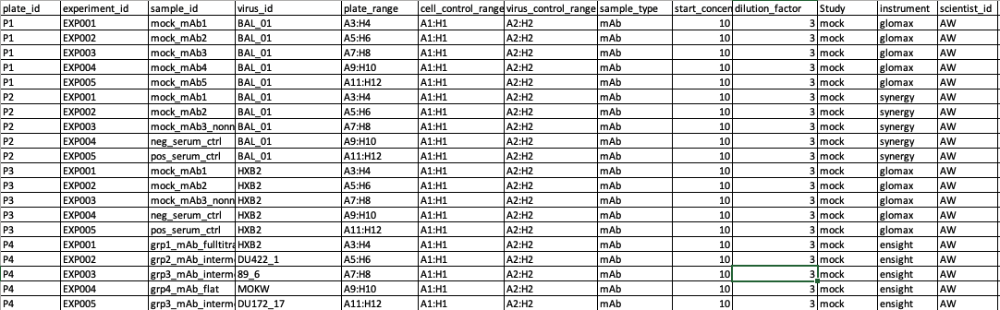

# Neutralisation Assay – Shiny Dashboard
The following repository consists of the first version of the Neut Assay dashboard.

## Quick information:


** This image was generated by chatgpt (source: https://chatgpt.com/) using biorender (source: https://www.biorender.com/)


## Quick Start

### 1. Install R dependencies

```r
install.packages(c(
  "shiny", "shinydashboard", "shinyjs",
  "readxl", "openxlsx",
  "tidyverse", "ggplot2", "scales",
  "DT", "plotly",
  "glue", "gridExtra", "rhandsontable"   # rhandsontable is optional
))
```

### 2. Run the app

```r
shiny::runApp("path/to/neut_dashboard/")
```

Or from RStudio: open `app.R` → click **Run App**.

---

## Dashboard Tabs

| Tab | Description |
|-----|-------------|
| 🏠 Overview | Summary value boxes and workflow guide |
| ⚙️ Helper Setup | View/edit the `experiments` & `Setup` sheets live |
| 🧪 Plate Data Upload | Upload one or more raw XLS plate files |
| 📊 Inhibition Curves | Interactive neutralisation curves per plate/virus/sample |
| 🔢 Titer Results | IC50 & IC80 titer table + bar chart |
| 🔬 Controls QC | Cell & virus control averages with CV% highlighting |
| 📋 Plate View | Full renamed RLU matrix per plate |
| 💾 Export | Download XLSX workbook matching the original pipeline output |

---

## Input Files

### Helper file (`universal_helper_file.xlsx`)
Must contain one sheet which looks as follows (also, an example is attached):



NOTE: The dashboard can accommodate data produced from four platforms (which would be mentioned under "instrument" column):
- victor-5
- ensight
- synergy
- glomax

**`experiments`** — one row per bnab × virus experiment:

| Column | Description |
|--------|-------------|
| `plate_id` | e.g. `P1` |
| `experiment_id` | e.g. `EXP001` |
| `bnab_id` | Antibody / serum ID |
| `virus_id` | Virus ID |
| `plate_range` | Column pair for sample replicates, e.g. `3:4` |
| `start_concentration` | Starting conc (µg/mL) or starting dilution |
| `dilution_factor` | e.g. `3` for 3-fold |
| `cell_control_range` | Column containing cell-only control, e.g. `1:1` |
| `virus_control_range` | Column containing virus control, e.g. `2:2` |
| `sample_type` | `mAb` or `Serum` |

**`Setup`** — one row per plate:

| Column | Description |
|--------|-------------|
| `Plate` | Plate ID matching `experiments.plate_id` |
| `Sample_direction` | `left_to_right` / `right_to_left` / `up_to_down` / `down_to_up` |
| `Dilution_direction` | Same options |

### Plate XLS files
- Named: `YYYYMMDD_<any>_<any>_<plate_id>.xls`
- Data read from sheet `Plate_Page1`, range `A7:L14` (8 rows × 12 columns)
- The 4th underscore-separated token is used as the `plate_id`

---

## Analysis Methods

- **% Inhibition** = `max(0, 1 - (avg_sample - cell_avg) / (virus_avg - cell_avg))`
- **IC50 and IC80**
- **Dilution series** = `start_conc / dil_factor^(0..n)` for mAb; `start_conc × dil_factor^(0..n)` for Serum
- **Orientation** = plate matrix transposed when `sample_direction` is `up_to_down` or `down_to_up`

---

## Output XLSX Sheets

| Sheet | Contents |
|-------|----------|
| `experiments` | Copy of helper experiments |
| `setup_summary` | Copy of plate setup |
| `control_averages` | avg, sd, CV% per control per plate |
| `inhibition_detail` | Full inhibition table with RLU values |
| `titers` | IC50 & IC80 per sample/virus (colour-coded) |
| `<plate_id>` | Renamed RLU matrix for each plate |
